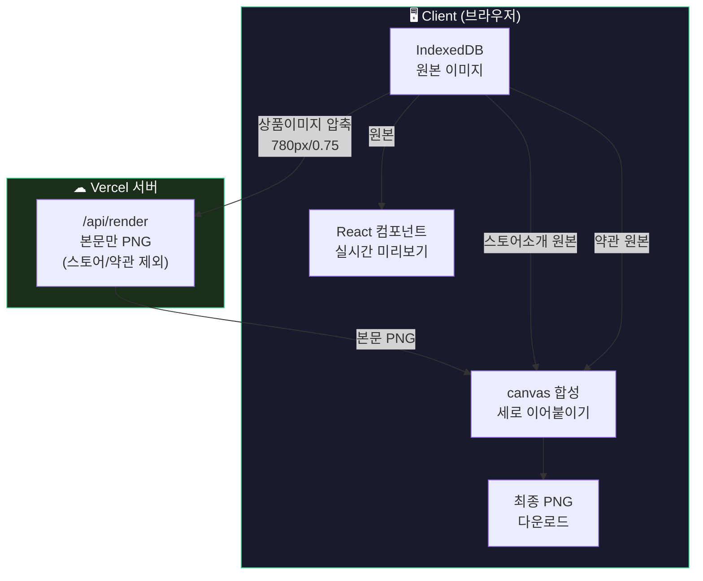

# PageCraft 이슈 트래커

> 해결된 이슈, 개선사항, 아키텍처 변경 기록

---

## #1. Vercel 배포 환경 payload 제한 대응

**오류 텍스트**
```
POST /api/ai/copy 413 (Content Too Large)
ApiError: Request Entity Too Large — FUNCTION_PAYLOAD_TOO_LARGE
```

**문제 상황**
- 상품 이미지 3~4장 이상 업로드 후 상세페이지 생성 버튼 누르면 413 에러 발생
- AI 모델 이미지 생성도 동일하게 실패
- 로컬에서는 정상이지만 Vercel 배포 후에만 발생

**원인**
- Vercel 무료 티어 body 제한: **4.5MB** (Pro도 동일)
- 상품 이미지를 base64 원본으로 서버에 전송 (이미지 1장당 ~200KB~1MB)
- 이미지 10장 + 스토어/약관 이미지 합치면 4.5MB 쉽게 초과
- `next.config.ts`의 `bodySizeLimit` 설정은 Vercel 플랫폼 제한과 무관 (서버 자체 설정일 뿐)

**해결 방법**
- AI 분석용 이미지만 `compressForAI(400px, 0.5)` 압축 후 전송 (최대 5장, ~250KB)
- 상세페이지 렌더링은 클라이언트 미리보기 + 서버 다운로드 하이브리드로 전환 (아래 #3 참고)

**개선 전후 비교**

| | 변경 전 | 변경 후 |
|---|---|---|
| AI 전송 이미지 | 원본 800px, 전체 | 400px/0.5, 최대 5장 |
| AI payload | ~2MB | ~250KB |
| 렌더 전송 이미지 | 원본 + 스토어/약관 전부 → 서버 POST | 상품 이미지만 780px 압축, 스토어/약관 미전송 |
| Vercel 제한 | 4.5MB에 걸림 | 제한 내 |

**관련 파일**: `src/lib/image.ts`, `src/components/image/AiModelToggle.tsx`, `src/hooks/useAIGenerate.ts`

---

## #2. 상세페이지 PNG 다운로드 — 클라이언트 렌더링 라이브러리 검토 과정

**목표**
- 미리보기를 HTML React 컴포넌트로 전환 → 실시간 반영
- PNG 다운로드도 클라이언트에서 처리 → 서버 부하 제로, Vercel 제한 회피

**시도한 라이브러리와 결과**

### 시도 1: html2canvas

```
npm install html2canvas
```

| 항목 | 결과 |
|------|------|
| 영문 텍스트 | 정상 |
| 한글 텍스트 | **자간 깨짐** — 글자가 겹치거나 벌어짐 |
| `scale: 2` | 빈 이미지 출력 (흰색) |
| `scale: 1` | 출력되지만 한글 품질 불량 |
| `foreignObjectRendering: true` | `scale: 2`에서 빈 이미지, `scale: 1`에서도 여전히 깨짐 |

**원인**: html2canvas는 DOM을 자체 파싱해서 canvas API로 다시 그림. 이 과정에서 브라우저의 폰트 메트릭과 canvas API의 `measureText`가 달라서 한글 글리프 간격이 틀어짐.

### 시도 2: dom-to-image-more

```
npm install dom-to-image-more
```

| 항목 | 결과 |
|------|------|
| 방식 | DOM → SVG → PNG (SVG foreignObject 기반) |
| 한글 폰트 | html2canvas보다 나을 거라 기대했으나 동일 |
| 렌더링 | **모든 텍스트 요소에 사각형 테두리** 생성 |
| `scale: 2` | 아티팩트 더 심해짐 |

**원인**: SVG foreignObject 렌더링 시 브라우저가 각 텍스트 요소의 경계 박스를 그림. CSS 스타일 복제 과정에서 border/outline이 추가되는 버그.

### 결론: 클라이언트 캡처로는 한글 품질 보장 불가

| 라이브러리 | 한글 자간 | 아티팩트 | 고해상도 | 판정 |
|-----------|----------|---------|---------|------|
| html2canvas | 깨짐 | 없음 | 빈 이미지 | ❌ |
| dom-to-image-more | 깨짐 | 사각형 테두리 | 아티팩트 | ❌ |
| 서버 @napi-rs/canvas | **완벽** | 없음 | 완벽 | ✅ |

**이유**: 서버 `@napi-rs/canvas`는 폰트 파일(OTF)을 직접 등록하고 `registerFont` → `ctx.font` → `ctx.fillText`로 글자를 직접 그림. 클라이언트 라이브러리는 브라우저 렌더링을 "캡처"하려는 시도를 하는 것이라 근본적으로 정확도가 다름.

---

## #3. 최종 해결 — 서버×클라이언트 하이브리드 렌더링

**문제 상황**
- 서버 렌더링만: Vercel 4.5MB 제한 + 스토어/약관 이미지 이중 압축 열화
- 클라이언트 렌더링만: 한글 폰트 깨짐 (위 #2 참고)
- 스토어 소개/약관 이미지는 특히 압축 → 서버 전송 → PNG 재인코딩으로 열화가 심함

**해결 방법: 역할 분리**

| 역할 | 담당 | 이유 |
|------|------|------|
| **미리보기** | 클라이언트 (React HTML) | 실시간 반영, 원본 이미지 |
| **본문 PNG** | 서버 (@napi-rs/canvas) | 한글 폰트 완벽 |
| **상하단 이미지 합성** | 클라이언트 (canvas) | 원본 화질 유지, 서버 전송 불필요 |

**다운로드 흐름**



**합성 구조**
```
┌───────────────────┐
│ 스토어 소개 (원본)  │ ← 클라이언트에서 원본 그대로
├───────────────────┤
│                   │
│  본문 PNG (서버)   │ ← @napi-rs/canvas, 한글 완벽
│  (헤더~가격 푸터)   │
│                   │
├───────────────────┤
│ 약관 (원본)        │ ← 클라이언트에서 원본 그대로
└───────────────────┘
```

**개선 전후 비교**

| | 전체 서버 렌더링 | 하이브리드 (최종) |
|---|---|---|
| 서버 전송 payload | 상품img + 스토어 + 약관 (~4MB+) | 상품img만 (~1.5MB) |
| 스토어/약관 화질 | 780px/0.75 이중 압축 열화 | **원본 그대로** |
| 본문 한글 폰트 | 완벽 | 완벽 (서버 유지) |
| 미리보기 반영 | API 2~3초 | **실시간** |
| Vercel 4.5MB | 초과 위험 | 안전 |

**관련 파일**:
- `src/components/editor/DetailPagePreview.tsx` — 실시간 HTML 미리보기
- `src/app/product/new/page.tsx` — 다운로드 로직 (서버 PNG + 클라이언트 합성)
- `src/services/render.service.ts` — 서버 본문 렌더링 (스토어/약관 제외)
- `src/lib/image.ts` — `compressForRender`, `compressForAI`
